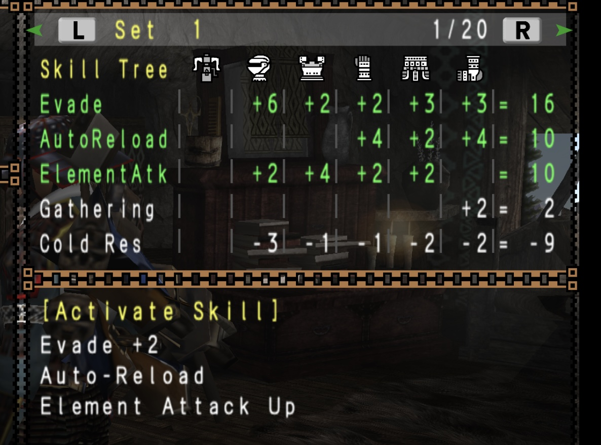

<p align="center">
  <a href="https://github.com/Kolyn090/mhfu-db/blob/main/assets/MHFU_MainTitle.PNG">
    
  </a>
</p>

<h1 align="center">
  Monster Hunter Freedom Unite Gear Simulator
</h1>

Welcome to this dedicated repo for a 15 years-old game! If you have played the MH series before, 
I shall remind you that this is not about MHGU, MHW, MHR, or MH Wild... It's MHFU! 
(or MHP2G in Japan) 

### ❓What is this
This is a gear simulator for game Monster Hunter Freedom Unite by CAPCOM. You can use this to simulate different sets of armors in game. The data used is from another repo of mine: https://github.com/Kolyn090/mhfu-db.git I have written one gear simulator years ago, but that one was for MHP2G (MHFU in 🇯🇵) You can check it here: https://github.com/Kolyn090/mh2g-gear-simulator.git 

### 📔Terminology
Armor: The playable character in MHFU can wear *five* different parts of armor: helmet, plate, gauntlet, waist, legging. They are individually referred as armor.

Weapon: The weapon to be carried by the playable character.

Equipment: Referring an Armor or a Weapon.

Gear set: Referring a whole set of equipments (Armors + Weapon).

Decoration: Attachable to an equipment. Requires enough slots (space) to be attached to them.

### ❓Where do I start
After downloading the source code, the first thing you need to do is to download the DB from https://github.com/Kolyn090/mhfu-db.git

The second step is to add a "dotenv.js" file under the src directory. Inside "dotenv.js", you add:
``` js
const DB_DIRECTORY = "../mhfu-db"; // replace this with the path to DB. I am using a relative path here and gear simulator folder is under the same directory as DB

module.exports = {
    DB_DIRECTORY
}
```
The third step is to go to main.js. Scroll down to the end and you should see something like this:
```js
const skill_names = [];
const filter = (armor) => armor.filter(a=>...);
const weapon_slots = 1;
```
You can go ahead and add the skills you want into that skill_names list. For reference, please look into the DB's skill.json file. The "name" property is what you want to type in here. You can also change the filter option as well as the weapon slot number. After done everything, type the following command in terminal and hit enter.
```zsh
npm i
```
Now type the following command in terminal and hit enter.
```zsh
node main
```
The program will start to execute and you might have to wait for a while depending on the skills you entered. If you have no idea how to use terminal, please check out: https://www.freecodecamp.org/news/command-line-for-beginners/

### 🕵️‍♂️Algorithm
This is the ❗️most important❗️ part of this repo. The algorithm I am using to make this gear simulator is nothing fancy. Basically, it can be decribed as following:

1. Get all necessary data from my DB (Armors, Skills, Decorations)
2. Filter out all unwanted Armors and Decorations (meaning have nothing to do with the skills we want)
3. Compare all remaining armors two by two. Eliminate if one is completely inferior to another (has all required skills being surpassed + losing in slot numbers)
4. Attach decorations to remaining armors, with all possible combinations (so each armor will have multiple versions, but all of them will be filled with decorations, no empty slot will be left in the end)
5. Filter out all outclassed decorated armors, very similar (but not quite the same) to what we did in step 3. There was a small tweak to deal with same armors being compared to prevent from too many armors being eliminated.
6. Categorize all decorated armors into five categories: helmet, plate, gauntlet, waist, legging.
7. Create a virtual weapon, and its only vital information is the slot number. 
8. Create different decorated weapon versions, just like what we did for armors.
9. Create a level-6 nested loop to form gear sets and attempt to find one satisfying the required skills.

Performance: since there is a presence of giant nested loop, a good performance generally cannot be expected. That's why the algorithm is doing its best to elminate as many armors as possible from the start, as they are the major threats. The algorithm eliminates armors that it knows (very likely) won't be part of the final set (or there just happen to be better ones out there). It also evaluates all equipments with all different decoration combs attached. Therefore, it will find a solution if there exists one. Otherwise, it will appear to be got stuck for a long time and stop when it finishes the loop.

### ❓Hmmm, I still don't know what you are trying to solve...
(⏩ Skip this part if you already have a good idea) Don't worry. If you have not played the game before and you are interested to know what this does, keep reading. First of all, let's start with the problem statement: Imagine your game character can wear *five* different parts of armor: helmet, plate, gauntlet, waist, legging. Also, you character can carry *one* weapon. Easy to understand, huh? Now it's a bit more confusing, each armor & weapon (equipment 🪖) can be attached with decorations to make them more powerful. Each armor & weapon has 1 ~ 3 slots for decorations to be attached on them. However, each decoration might take 1 ~ 3 slots to be attached. For example, a decoration requiring 1 slot can be attached on an equipment with 3 slots three times. However, a decoration requiring 2 slots or 3 slots can only be attached on the same equipment once. In addition, a decoration can be attached multiple times on the same equipment. Here is the complete list:

| Equipment (slots)     | Decoration Combo (consuming slots) |
| --- | --- |
| 1   | 1   |
| 2   | 1 + 1  (two slot-1 decorations) |
| 2   | 2 |
| 3   | 1 + 1 + 1 |
| 3   | 1 + 2 (order doesn't matter) |
| 3   | 3 |

You might be wondering: Why should the players know this? This slot-decoration stuff is really for adding skills🍳 to gears. The skill system in this game can be even more confusing if you haven't played the Monster Hunter series before. It goes like this: each skill, when activated, can add a new ability to the player character. To activate one, the player must have enough  points for that skill. To gain points, you have guessed, is through decorations & equipments. Each decoration & equipment possesses some skill points. Such as:
<p align="center">
  <a href="https://github.com/Kolyn090/mhfu-gear-simulator/blob/main/assets/IMG_2447.jpg">
    
  </a>
</p>
Here, Mafumofu Hood has four kinds of skill points: Protection, Heat Res, Cold Res, PsychicVis. Each skill point is indicated after the skill. Decorations work in the same manner, except that they can be attached to equipments. Now is a good time to finally show you how skills are actually calculated.

To make explanation easier, let's look at the following screenshot from the game:
<p align="center">
  <a href="https://github.com/Kolyn090/mhfu-gear-simulator/blob/main/assets/IMG_2449.jpg">
    
  </a>
</p>

Here, I have grind enough skill points for the top three skill points in green: Evade, AutoReload, ElementAtk. ❗️ An important thing you should know is that the skill point represented in equipments might have a different name from the skill's actual name. For example: "Element Attack Up" is the skill name, while in the equipments it will show "ElementAtk" as skill point name. This is one thing to bear in mind while designing this gear simulator. ❗️ 

I hope by far you have grasped the basics. To make things less complicated, I have hidden away some unnecessary details, such as Torso Inc. 

### ❓How is this gear simulator different from the one you have written before
The biggest difference is that. The language for gears are now in 🇺🇸. Besides that, the two algorithms are completely reversed. Before (back then years ago), my main goal was to find the desired gear set fast but during the process the simulator has resulted in many false-negative cases - valid gear sets are often evaluated as invalid. It was really a exchange of correctness for efficiency because of its terrible filtering-based-on-scores system. Thus, in this version, I have completely eliminated the need for scoring system for more accurate outcomes. In this new algorithm, the system won't eliminate any equipment unless absolutly necessary. The system will also evaluate all possible states of equipments after equipping all possible relevant decorations, which was very difficult to achieve in the previous version. That being said, this algorithm can stress the CPU a lot, but it guarantees a solution (if there really exists one). Thus, I have attempted to briefly optimize the algorithm. 
