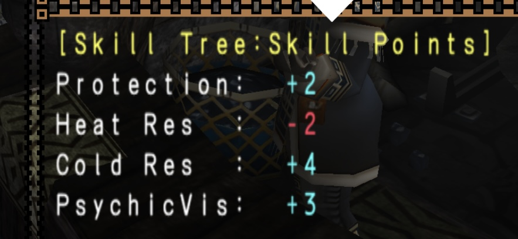

  

<h1 align="center">
  Monster Hunter Freedom Unite Gear Simulator
</h1>

Welcome to this dedicated repo for a 15 years-old game! If you have played the MH series before, 
I shall remind you that this is not about MHGU, MHW, MHR, or MH Wild... It's MHFU! 
(or MHP2G in Japan) 

### ❓What is this?
This is a gear simulator for game Monster Hunter Freedom Unite by CAPCOM. You can use this to simulate different sets of armors in game. The data used is from another repo of mine: https://github.com/Kolyn090/mhfu-db.git I have written one gear simulator years ago, but that one was for MHP2G (MHFU in 🇯🇵) You can check it here: https://github.com/Kolyn090/mh2g-gear-simulator.git 

### 📔Terminology
Armor: The playable character in MHFU can wear *five* different parts of armor: helmet, plate, gauntlet, waist, legging. They are individually referred as armor.

Weapon: The weapon to be carried by the playable character.

Equipment: Referring an Armor or a Weapon.

Gear set: Referring a whole set of equipments (Armors + Weapon).

Decoration: Attachable to an equipment. Requires enough slots (space) to be attached to them.

### 🕵️‍♂️Algorithm

### ❓Hmmm, I still don't know what you are trying to solve...
(⏩ Skip this part if you already have a good idea) Don't worry. If you have not played the game before and you are interested to know what this does, keep reading. First of all, let's start with the problem statement: Imagine your game character can wear *five* different parts of armor: helmet, plate, gauntlet, waist, legging. Also, you character can carry *one* weapon. Easy to understand, huh? Now it's a bit more confusing, each armor & weapon (equipment 🪖) can be attached with decorations to make them more powerful. Each armor & weapon has 1 ~ 3 slots for decorations to be attached on them. However, each decoration might take 1 ~ 3 slots to be attached. For example, a decoration requiring 1 slot can be attached on an equipment with 3 slots three times. However, a decoration requiring 2 slots or 3 slots can only be attached on the same equipment once. In addition, a decoration can be attached multiple times on the same equipment. Here is the complete list:

| Equipment (slots)     | Decoration Combo (consuming slots) |
| --- | --- |
| 1   | 1   |
| 2   | 1 + 1  (two slot-1 decorations) |
| 2   | 2 |
| 3   | 1 + 1 + 1 |
| 3   | 1 + 2 (order doesn't matter) |
| 3   | 3 |

You might be wondering: Why should the players know this? This slot-decoration stuff is really for adding skills🍳 to gears. The skill system in this game can be even more confusing if you haven't played the Monster Hunter series before. It goes like this: each skill, when activated, can add a new ability to the player character. To activate one, the player must have enough  points for that skill. To gain points, you have guessed, is through decorations & equipments. Each decoration & equipment possesses some skill points. Such as:

  

Here, Mafumofu Hood has four kinds of skill points: Protection, Heat Res, Cold Res, PsychicVis. Each skill point is indicated after the skill. Decorations work in the same manner, except that they can be attached to equipments. Now is a good time to finally show you how skills are actually calculated.

To make explanation easier, let's look at the following screenshot from the game:

  

Here, I have grind enough skill points for the top three skill points in green: Evade, AutoReload, ElementAtk. ❗️ An important thing you should know is that the skill point represented in equipments might have a different name from the skill's actual name. For example: "Element Attack Up" is the skill name, while in the equipments it will show "ElementAtk" as skill point name. This is one thing to bear in mind while designing this gear simulator. ❗️ 

I hope by far you have grasped the basics. To make things less complicated, I have hidden away some unnecessary details, such as Torso Inc. 

### ❓How is this gear simulator different from the one you have written before?
The biggest difference is that. The language for gears are now in 🇺🇸. Besides that, the two algorithms are completely reversed. Before (back then years ago), my main goal was to find the desired gear set fast but during the process the simulator has resulted in many false-negative cases - valid gear sets are often evaluated as invalid. It was really a exchange of correctness for efficiency because of its terrible filtering-based-on-scores system. Thus, in this version, I have completely eliminated the need for scoring system for more accurate outcomes. 